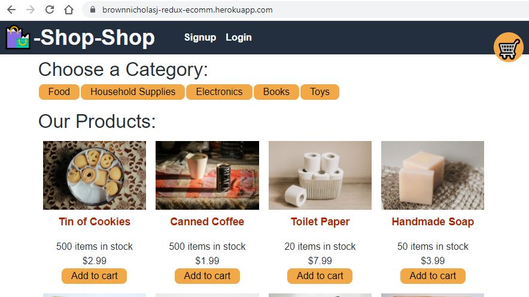
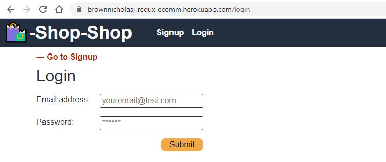
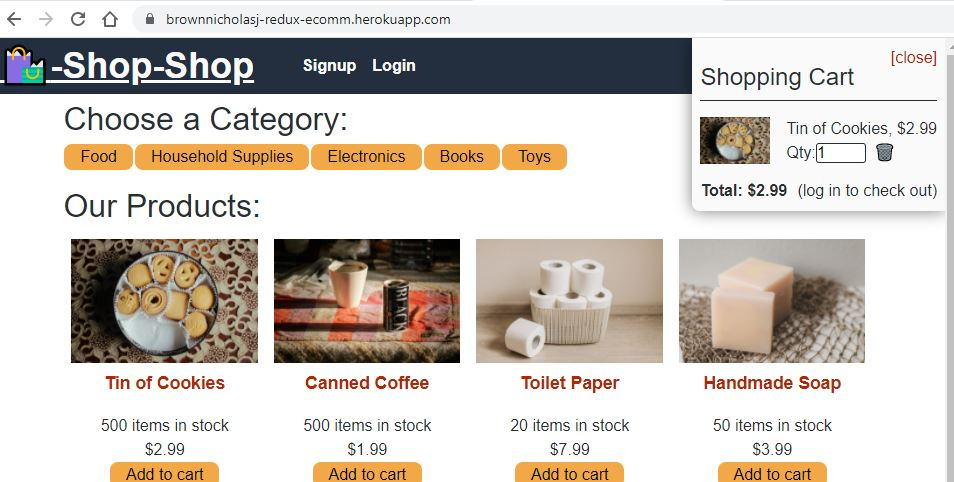
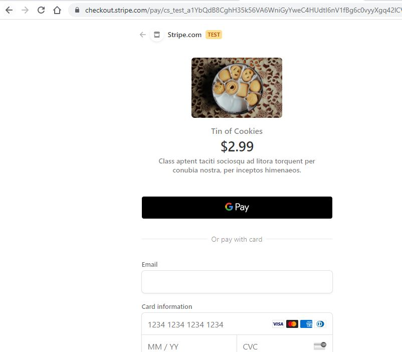
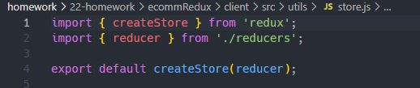
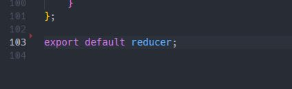
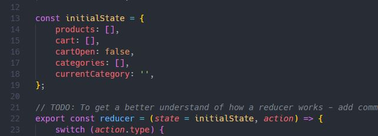
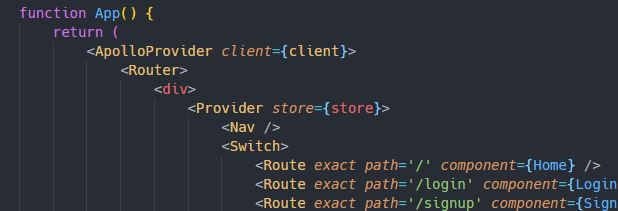
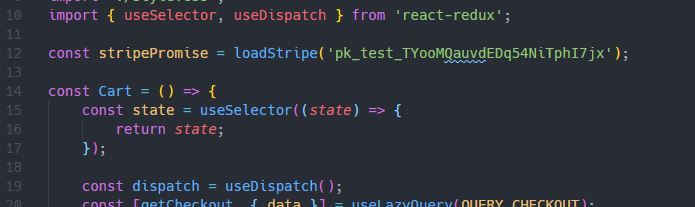

# Redux E-Commerce

## Description

Link to App: https://brownnicholasj-redux-ecomm.herokuapp.com/

- This Shop-Shop e-commerce site was refactored from using the context api to
  using redux library to handle the more complex state management.
- The technology used for this application are: node, javascript, express (npm),
  apollo-server-express (npm), mongoose (npm), graphql (npm), bcrypt (npm),
  dotenv (npm), jsonwebtoken (npm), jwt-decode (npm), redux (npm), stripe (npm),
  reactjs, MongoDB, Heroku
- The biggest challenge here was understanding the redux library from scratch
  and once getting the basics, building it into an environment that had a
  workable code base. Once I found the basics of createStore and implementing it
  into the App.js, I allowed the error messages along with the redux
  documentation and explanations found online to work through the issues to get
  to completion.

## Table of Contents

- [Usage](#usage)
- [License](#license)
- [Contributing](#contributing)
- [Behind The Code](#behind-the-code)
- [Questions](#questions)

## Usage

A user will go to the page at https://brownnicholasj-redux-ecomm.herokuapp.com/
and see the landing page with the option to view categories and products and
login/signup 

If the user chooses Login/Sign Up they will be directed to the respective page

The user can add products to their cart, if the user is NOT signed in, they will
not be allowed to checkout 

When the logged in user wants to checkout, they will be directed to stripe.com
(Test license) to submit their transaction through their services

## License

This project is licensed under the MIT license.

## Contributing

A thanks to the following contributors to this project:

- 2021 Trilogy Education Services, LLC
- Nicholas Brown (brownnicholasj.dev@gmail.com)

### Behind the Code

As the back end of the code was 'provided' by Trilogy Education Services, this
review will be focused on the front end code that was refactored to use Redux.

- Redux requires a store to be created, accomplished this by creating a store.js
  within the utils folder 

- To link the reducers to the createStore, refactored the reducers.js to export
  the reducers 

- Since we refactored to utilize redux createStore, we completely removed the
  GlobalState.js. The only thing we needed from it was the initialState, which
  we brought over and housed in the reducers.js
  

- We initiated the new method of storing the state in the App.js by importing
  the store.js and Provider from react-redux, we then serve the Producer and the
  store in the return 

- We then had to utilize the redux useSelector and useDispatch methods where we
  passed the state. This followed a relatively simple pattern that we
  implemented on all required components. 

## Questions

If you have any questions about the repo, open an issue or contact me directly
at brownnicholasj.dev@gmail.com.You can find more of my work at
[brownnicholasj](https://github.com/brownnicholasj/).
